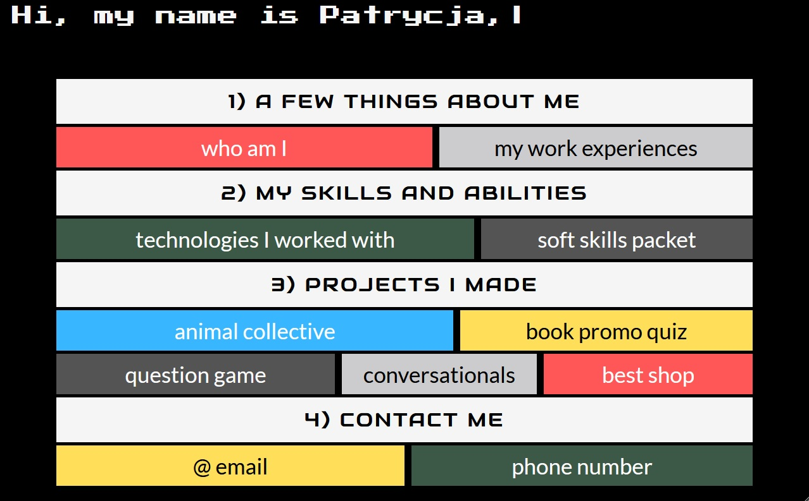

# Portfile - my online portfolio

> Portfile is basically the name of my online portfolio, which has been displayed online here: [My portfolio](https://pokorra.github.io/portfile/)

## Table of contents

- [General info](#general-info)
- [Screenshot](#screenshot)
- [Technologies](#technologies)
- [Status](#status)

## General info

Hi, my name is Patrycja Pokora and I have created this project as an alternative to online Resume. I have made it to collect in one place both informations about me as a person and as an epmloyee, and data on few of my other projects. Structure of this site is simple: below the header containing simple typing animation you can see few sections with the content concerning myself, my skills and abilities and obviously the projects I have made. By clicking on particular element, you will see more on the subject you have picked.

## Screenshot

## Technologies

### setup

To run this project, please install node packages in the folder containing it. You can use `npm install` command to make sure everything is on its place. After that, just type `npm start`, and the project will run in the development mode.

### react

This project was bootstrapped with [Create React App](https://github.com/facebook/create-react-app).

### scss

I wanted this project to look kind of old school, but not the kitschy way. To achieve that, I tried to made it look a little like a poster from 80's.
I was naming SCSS classes according to BEM methodology, although I have decided to organize my files equivalently of the React component files. I felt like this approach will make my code more transparent.

## Status

My portfolio project is like a Schrödinger's cat - both done and undone ;) Despite being finished, it still could be edited every once in a while, especially the section containing my projects.

# Thank you for viewing my portfolio, I really hope you have enjoyed it!

## best regards, Patrycja Pokora
